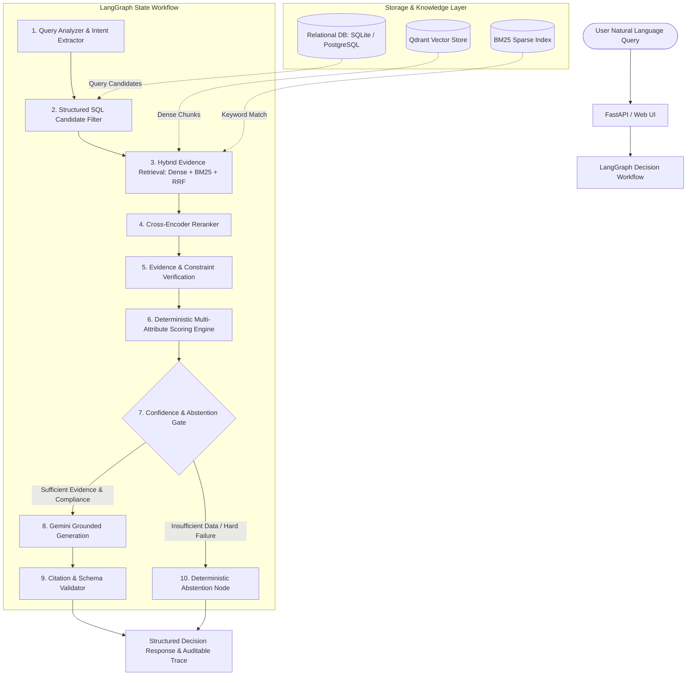

# Requirements

### Overview & Goals
The **AI Decision Engine V2** is transformed from a hardware recommendation tool into a production-grade, portfolio-worthy **Evidence-Driven Mutual Fund Decision Support System**. The system is not a conversational chatbot, a naive generic RAG wrapper, or an autonomous financial advisor. Instead, it is an auditable, deterministic-first decision support system that parses complex investor preferences (monthly SIP vs. lump sum, horizon, risk tolerance, category, expense ratio thresholds), executes parameterized SQL filtering alongside hybrid unstructured document retrieval (factsheets, Scheme Information Documents / SIDs, investment objectives), verifies evidence, deterministically scores risk-adjusted metrics, generates grounded natural-language explanations with Gemini, and strictly abstains when evidence or constraint satisfaction is insufficient.

### Scope
- **In Scope:**
  - **Relational SQL Store & Data Layer:** Normalized SQLAlchemy schema (funds, historical performance, derived risk-adjusted metrics like Sharpe, volatility, alpha, expense ratio, AUM, exit load) with parameterized queries for exact candidate retrieval.
  - **Unstructured Document Ingestion & Hybrid RAG:** Ingestion of mutual fund scheme documents, investment objectives, factsheets, and risk disclosures into sentence-aware chunks with preserved provenance, indexed via Qdrant dense vector search (`BAAI/bge-small-en-v1.5`) and BM25 sparse search with Reciprocal Rank Fusion (RRF).
  - **Cross-Encoder Reranking & Evidence Validation:** Transformer cross-encoder scoring of candidate evidence chunks with calibrated interpretation and verification against structured database facts.
  - **Deterministic Decision & Multi-Attribute Scoring Engine:** Explicit tri-state hard constraint evaluation (`PASS`, `FAIL`, `UNKNOWN`), risk-adjusted preference scoring, bounded candidate evaluation (candidates must originate from filtered/retrieved sets), pairwise trade-off generation, and multi-factor system confidence calculation (`LOW`, `MEDIUM`, `HIGH`) with an abstention gate.
  - **LangGraph Workflow Orchestration:** Explicit typed state graph coordinating query analysis, validation, SQL candidate retrieval, hybrid RAG, reranking, evidence validation, decision scoring, confidence gating, grounded generation, and citation verification.
  - **Gemini Grounded Generation & Citation Verification:** Pluggable LLM provider (`GeminiProvider` via Gemini API with deterministic `MockProvider` fallback for offline tests), strict Pydantic output validation, and programmatic citation validation (citations mapped strictly to verified chunk IDs).
  - **FastAPI REST API & Minimal UI:** Endpoints `POST /api/v1/decisions`, `GET /health`, `GET /ready`, human-readable Decision Trace, latency/cost tracing, and a clean, utilitarian web interface.
  - **Evaluation & Failure-First Benchmark:** 50+ benchmark query test suite (`data/evaluation/queries.json`) evaluating query parsing, IR metrics (`Recall@K`, `MRR`, `NDCG@K`), decision accuracy, grounding/citation coverage, abstention correctness, token usage, and latency.
  - **Containerization, CI/CD & Deployment:** Dockerfile, `docker-compose.yml`, GitHub Actions CI pipeline, and Azure container deployment documentation.
- **Out of Scope:**
  - Autonomous live portfolio trading or order execution.
  - Real-time stock-ticker streaming or tick-level intraday prediction.
  - Flashy UI animations, complex dashboards, or commercial payment gateways.

### User Stories
- **US-1 (Retail / Long-Term Investor):** As an investor with specific financial parameters (e.g., *"I have ₹5,000 per month, moderate risk tolerance, and want to invest for 5 years with low expense ratios"*), I want structured recommendations that strictly respect my monthly budget, risk appetite, and horizon while detailing the trade-offs between leading funds.
- **US-2 (Research Analyst / Auditor):** As a financial analyst, I want to inspect a transparent Decision Trace and chunk-level citations for every factual claim so that no model hallucination or unverified performance metric can influence decisions.
- **US-3 (Compliance & Risk Officer):** As a compliance reviewer, I want the system to cleanly abstain or report `UNKNOWN` whenever data is missing, ambiguous, or when no fund satisfies the stated constraints, accompanied by standard financial disclaimers.
- **US-4 (ML Engineer / Interview Evaluator):** As an engineer evaluating the system, I want to run benchmark evaluation scripts measuring IR ranking, decision accuracy, citation faithfulness, latency, and LLM token costs across normal and failure-mode queries.

### Functional Requirements
- **FR-1 (Domain Modeling & SQL Storage):** Maintain normalized tables for `funds`, `fund_performance`, `fund_metrics`, and `document_chunks` with SQLite (local) and PostgreSQL (production) compatibility, supporting parameterized queries for exact numeric and categorical filtering.
- **FR-2 (Document Ingestion & Provenance):** Ingest scheme information documents, factsheets, and fund disclosures; clean and chunk text while strictly maintaining metadata (`fund_id`, `document_id`, `document_type`, `source_url`, `publication_date`, `chunk_index`).
- **FR-3 (Query Analysis & Disambiguation):** Extract investment amount, frequency (SIP vs lump-sum), investment horizon, risk tolerance, hard constraints, soft preferences, and comparison targets into a strongly typed Pydantic `DecisionQuery`.
- **FR-4 (Structured Filtering & Hybrid Retrieval):** Execute SQL filtering to establish a bounded candidate pool, followed by parallel dense vector search (Qdrant) and sparse lexical search (BM25) over candidate fund chunks, fused via Reciprocal Rank Fusion (RRF).
- **FR-5 (Cross-Encoder Reranking):** Rerank retrieved candidate chunks using a cross-encoder model to produce relevance-ordered evidence pools without arbitrary score clamping.
- **FR-6 (Evidence Validation & Tri-State Constraints):** Evaluate hard constraints into `PASS`, `FAIL`, or `UNKNOWN` (missing metadata is never treated as automatic pass), and cross-verify claims against retrieved chunks and structured fund metrics.
- **FR-7 (Deterministic Scoring & Trade-offs):** Calculate multi-attribute utility scores (risk-adjusted return/Sharpe, expense ratio efficiency, AUM stability, category consistency, evidence quality), rank candidates, and produce pairwise trade-off deltas.
- **FR-8 (Confidence Calculation & Abstention Gate):** Calculate system confidence based on hard constraint completeness, score margin, evidence quality, and data freshness. If confidence is below threshold or constraints cannot be met, route to deterministic abstention.
- **FR-9 (LangGraph Orchestration):** Coordinate the multi-step decision pipeline as an explicit state graph with conditional branching between grounded LLM generation and abstention.
- **FR-10 (Gemini Grounded Generation & Citation Verification):** Assemble evidence and decision context into system prompts for Gemini, validate full JSON output with Pydantic, and verify that every citation maps to an actual retrieved chunk.
- **FR-11 (REST API & Plain Web Frontend):** Provide `POST /api/v1/decisions` with structured responses, OpenAPI docs, and an unbloated HTML/JS interface displaying recommendation, trade-offs, citations, and the auditable Decision Trace.
- **FR-12 (Evaluation Harness):** Execute `scripts/evaluate.py` to compute extraction accuracy, IR metrics (`Recall@K`, `MRR`, `NDCG`), decision accuracy, citation precision, abstention correctness, token cost, and P50/P95 latency.

### Non-Functional Requirements
- **Financial Safety & Disclaimers:** Every response clearly identifies outputs as decision-support analysis based on historical data and available evidence, rather than personalized financial advice or return guarantees.
- **Type Safety & Reliability:** 100% type annotations with Pydantic v2 validation across all boundaries; zero unhandled crashes on malformed queries or unavailable external APIs.
- **Latency & Resource Efficiency:** Sub-second response times for cached/mock paths; bounded candidate retrieval and batched embeddings for efficient local CPU execution.
- **Security & Secret Hygiene:** Zero hardcoded API keys; `.env` configuration with complete `.env.example` templates.

# Migration Analysis

### Audit Findings & Component Mapping
1. **Reused Unchanged:**
   - Core configuration framework (`app/core/config.py` using `pydantic-settings`).
   - Structured JSON logging and sensitive key masking (`app/core/logging.py`).
   - Base exception hierarchies (`app/core/exceptions.py`).
   - Observability and span latency tracing (`app/observability/tracing.py`).
   - Sentence-aware text chunker logic with metadata propagation (`app/ingestion/chunkers/chunker.py`).
   - BM25 sparse indexer and tokenization utilities (`app/retrieval/sparse_retriever.py`).
   - Cross-encoder reranker inference wrapper (`app/reranking/reranker.py`).
2. **Reused with Modification:**
   - `app/retrieval/vector_store.py` & `app/retrieval/hybrid_retriever.py`: Modified to filter payloads by mutual fund attributes and bind candidate sets with SQL queries.
   - `app/generation/providers/`: Refactored to support `GeminiProvider` alongside `DeterministicMockProvider` and OpenAI-compatible endpoints.
   - `app/generation/citations.py`: Refactored into a strict two-way validator that validates LLM citations against retrieved chunk IDs and strips unverified citations.
   - `app/api/main.py` & schemas: Updated endpoints to accept mutual fund decision queries and return structured fund recommendations, trade-offs, and decision traces.
3. **Rewritten & Replaced (Removed Laptop Logic):**
   - Removed laptop specifications, GPU benchmarks, RAM/VRAM rules, and laptop catalogs (`app/decision/scoring.py`, `app/query/constraint_extractor.py`, `data/raw/laptops_sample.json`).
   - Rewritten data models to represent Mutual Funds, Scheme Information Documents, NAVs, and risk-adjusted metrics (`SharpeRatio`, `Alpha`, `ExpenseRatio`, `RiskLevel`, `AUM`, `LockIn`).
4. **Added New Components:**
   - **SQL Relational Layer (`app/db/`):** SQLAlchemy database models, SQLite/PostgreSQL engine, migrations/seeders, and `FundRepository` for parameterized queries.
   - **LangGraph Decision Workflow (`app/workflow/`):** State graph coordinating extraction, SQL filtering, RAG, verification, scoring, confidence gating, generation, and abstention.
   - **Evidence Validator (`app/evidence/validator.py`):** Structured and unstructured claim verification engine.
   - **Minimal Utilitarian Web UI (`app/static/` & `app/templates/`):** Functional browser interface for entering queries and inspecting recommendations, trade-offs, and decision traces.

### Architectural Fixes from Previous System
- **Candidate Bounding:** Candidate funds are explicitly produced by the SQL filtering and retrieval pipeline; the decision engine never scores out-of-scope catalog items in isolation.
- **Tri-State Constraint Evaluation:** Hard constraints evaluate strictly to `PASS`, `FAIL`, or `UNKNOWN`. Missing data is never coerced into a `PASS`.
- **Calibrated Cross-Encoder Scores:** Cross-encoder logits are evaluated for relative ranking within retrieved pools without arbitrary linear clamping.
- **Multi-Factor System Confidence & Abstention:** Confidence is derived from constraint completeness, score separation margin, evidence quality, and data freshness. The system deterministically abstains when evidence or compliance is insufficient.
- **Programmatic Citation Validation:** System prompts forbid unverified citations, and output validation strictly cross-checks every citation identifier against verified chunk IDs.

# Technical Design

### Key Decisions
1. **Two-Tiered Information Architecture (SQL + Hybrid RAG):**
   - *Decision:* Exact numerical filtering (investment limits, expense ratio ceilings, category, AUM, historical returns) is handled via parameterized SQL queries over structured tables. Qualitative facts (investment strategy, sector allocation commentary, risk disclosures, scheme objectives) are retrieved via Hybrid RAG (Qdrant dense + BM25 sparse + RRF).
   - *Rationale:* Vector search is unsuitable for hard numerical predicates, while SQL cannot capture semantic nuances in fund commentary. Combining both guarantees deterministic compliance with deep contextual reasoning.
2. **LangGraph Decision Workflow with Explicit Abstention Gate:**
   - *Decision:* Orchestrate the entire decision pipeline as a LangGraph state machine with an explicit confidence/abstention gate before calling the LLM.
   - *Rationale:* Decouples decision logic from LLM generation, ensuring that whenever data is ambiguous or no fund meets constraints, the system halts deterministically without wasting LLM tokens or risking hallucinations.
3. **Deterministic Multi-Attribute Utility Scoring:**
   - *Decision:* Product scoring is calculated using an explainable, weighted formula incorporating risk-adjusted return (Sharpe/Alpha), expense efficiency, AUM stability, and evidence quality.
   - *Rationale:* Eliminates LLM subjectivity in fund ranking and produces auditable mathematical justifications for why Fund A ranks over Fund B.
4. **Pluggable Gemini Provider with Mock Fallback:**
   - *Decision:* Implement Google Gemini 1.5/2.0 API integration with structured JSON schema outputs, alongside a deterministic `MockProvider` for hermetic testing.
   - *Rationale:* Leverages Gemini's strong reasoning for synthesis while enabling 100% offline development, testing, and continuous integration.

### Architecture Diagram



### Data Models & Contracts

```python
from typing import List, Dict, Any, Optional, Literal
from pydantic import BaseModel, Field
from datetime import date

class FundRecord(BaseModel):
    fund_id: str
    fund_name: str
    amc: str
    category: str
    sub_category: Optional[str] = None
    risk_level: Literal["Low", "Moderately Low", "Moderate", "Moderately High", "High", "Very High"]
    expense_ratio: float
    aum_crores: float
    min_sip_amount: float
    min_lump_sum: float
    exit_load: Optional[str] = None
    benchmark: str
    investment_objective: str
    scheme_type: Literal["Open Ended", "Close Ended"] = "Open Ended"
    plan_type: Optional[Literal["Direct", "Regular"]] = None
    data_as_of: date

class FundMetrics(BaseModel):
    fund_id: str
    cagr_1y: Optional[float] = None
    cagr_3y: Optional[float] = None
    cagr_5y: Optional[float] = None
    volatility_3y: Optional[float] = None
    sharpe_ratio_3y: Optional[float] = None
    alpha_3y: Optional[float] = None
    max_drawdown_3y: Optional[float] = None

class DocumentChunk(BaseModel):
    chunk_id: str
    fund_id: str
    document_id: str
    document_type: Literal["SID", "Factsheet", "KIM", "Commentary"]
    source_url: Optional[str] = None
    publication_date: Optional[date] = None
    text: str
    metadata: Dict[str, Any] = Field(default_factory=dict)

class QueryConstraints(BaseModel):
    max_monthly_investment: Optional[float] = None
    max_lump_sum: Optional[float] = None
    horizon_years: Optional[int] = None
    risk_tolerance: Optional[str] = None
    category_preference: Optional[List[str]] = None
    max_expense_ratio: Optional[float] = None
    min_aum_crores: Optional[float] = None
    plan_type: Optional[Literal["Direct", "Regular"]] = None

class DecisionQuery(BaseModel):
    raw_query: str
    intent: Literal["recommendation", "comparison", "explanation", "filter"]
    investment_amount: Optional[float] = None
    investment_frequency: Optional[Literal["monthly_sip", "lump_sum"]] = None
    horizon_years: Optional[int] = None
    risk_tolerance: Optional[str] = None
    constraints: QueryConstraints
    preferences: Dict[str, float] = Field(default_factory=dict)
    comparison_targets: List[str] = Field(default_factory=list)
    objective: Optional[str] = None

class ConstraintEvaluation(BaseModel):
    status: Literal["PASS", "FAIL", "UNKNOWN"]
    reasons: List[str] = Field(default_factory=list)
    missing_fields: List[str] = Field(default_factory=list)

class CandidateScore(BaseModel):
    fund_id: str
    fund_name: str
    constraint_status: Literal["PASS", "FAIL", "UNKNOWN"]
    violations: List[str] = Field(default_factory=list)
    risk_adjusted_score: float
    expense_score: float
    aum_stability_score: float
    evidence_quality_score: float
    final_score: float

class Tradeoff(BaseModel):
    fund_a: str
    fund_b: str
    advantages_a: List[str]
    advantages_b: List[str]
    summary: str

class Citation(BaseModel):
    citation_id: str
    chunk_id: str
    fund_id: str
    document_type: str
    source_url: Optional[str]
    snippet: str

class DecisionTraceStep(BaseModel):
    stage: str
    summary: str
    details: Dict[str, Any] = Field(default_factory=dict)

class DecisionResponse(BaseModel):
    query: str
    parsed_query: DecisionQuery
    abstained: bool = False
    abstention_reason: Optional[str] = None
    winner: Optional[CandidateScore] = None
    top_candidates: List[CandidateScore] = Field(default_factory=list)
    recommendation_text: str
    tradeoffs: List[Tradeoff] = Field(default_factory=list)
    citations: List[Citation] = Field(default_factory=list)
    confidence_level: Literal["LOW", "MEDIUM", "HIGH"]
    confidence_signals: Dict[str, Any] = Field(default_factory=dict)
    decision_trace: List[DecisionTraceStep] = Field(default_factory=list)
    disclaimer: str = (
        "Disclaimer: This analysis is provided for educational and decision-support purposes based on "
        "historical data and scheme documents. Past performance does not guarantee future results. "
        "Consult a certified financial advisor before making investment decisions."
    )
```

### File Structure & Module Responsibilities

```
ai-decision-engine-v2/
├── app/
│   ├── __init__.py
│   ├── api/
│   │   ├── __init__.py
│   │   ├── main.py              # FastAPI app with lifespan, routes, and static mount
│   │   ├── dependencies.py      # Dependency injection for DB session, models, workflow
│   │   ├── routes/
│   │   │   ├── __init__.py
│   │   │   ├── health.py        # /health and /ready probes
│   │   │   ├── decisions.py     # POST /api/v1/decisions
│   │   │   └── ui.py            # Simple frontend web router
│   │   └── schemas/
│   │       ├── requests.py      # Decision request schemas
│   │       └── responses.py     # Decision response & trace schemas
│   ├── core/
│   │   ├── config.py            # Settings (DB, Qdrant, Gemini, Models, Thresholds)
│   │   ├── logging.py           # Structured JSON logger with redaction
│   │   ├── exceptions.py        # Domain exceptions
│   │   └── dependencies.py      # Singleton lifecycle holders
│   ├── db/
│   │   ├── __init__.py
│   │   ├── session.py           # SQLAlchemy engine & session maker
│   │   ├── models.py            # SQL tables: Fund, Performance, Metrics, Document
│   │   └── repository.py        # Parameterized candidate queries & metric access
│   ├── ingestion/
│   │   ├── models.py            # Ingestion dataclasses & schemas
│   │   ├── loaders/
│   │   │   ├── base.py          # Abstract loader
│   │   │   ├── fund_data_loader.py # Loads structured fund records & metrics
│   │   │   └── document_loader.py  # Loads SID & Factsheet text/markdown files
│   │   ├── cleaners/
│   │   │   └── cleaner.py       # Document normalization & sanitization
│   │   ├── chunkers/
│   │   │   └── chunker.py       # Sentence-aware chunker with metadata propagation
│   │   └── pipeline.py          # Ingestion coordinator & DB seeder
│   ├── query/
│   │   ├── models.py            # DecisionQuery, QueryConstraints, Preferences
│   │   ├── analyzer.py          # Query analyzer orchestrator
│   │   ├── extractor.py         # Regex + LLM-assisted constraint extractor
│   │   └── rewriter.py          # Query rewriter for retrieval
│   ├── retrieval/
│   │   ├── models.py            # RetrievalResult, SearchPayload
│   │   ├── embeddings.py        # SentenceTransformer embedding wrapper
│   │   ├── vector_store.py      # Qdrant client with metadata filtering
│   │   ├── sparse_retriever.py  # BM25 sparse indexer
│   │   ├── hybrid_retriever.py  # RRF hybrid fusion coordinator
│   │   └── retriever.py         # Unified retriever bridging SQL candidates & chunks
│   ├── reranking/
│   │   ├── models.py            # RerankedResult schemas
│   │   └── reranker.py          # Cross-encoder reranker wrapper
│   ├── evidence/
│   │   ├── __init__.py
│   │   └── validator.py         # Evidence verification against structured facts
│   ├── decision/
│   │   ├── models.py            # CandidateScore, Tradeoff, DecisionResult
│   │   ├── constraints.py       # Tri-state constraint evaluator (PASS/FAIL/UNKNOWN)
��   │   ├── scoring.py           # Multi-attribute utility scoring engine
│   │   ├── tradeoffs.py         # Pairwise advantage/trade-off analyzer
│   │   ├── confidence.py        # Multi-factor confidence & abstention calculator
│   │   └── engine.py            # DecisionEngine coordinator
│   ├── workflow/
│   │   ├── __init__.py
│   │   ├── state.py             # LangGraph DecisionState typed dictionary
│   │   ├── nodes.py             # Workflow step nodes (extract, SQL, RAG, score, etc.)
│   │   └── graph.py             # LangGraph state machine definition
│   ├── generation/
│   │   ├── models.py            # Generation prompt & output schemas
│   │   ├── prompts.py           # Grounding system prompts with financial safety
│   │   ├── providers/
│   │   │   ├── base.py          # Abstract LLMProvider interface
│   │   │   ├── gemini.py        # Google Gemini provider with JSON mode
│   │   │   └── mock.py          # Deterministic offline mock provider
│   │   ├── citations.py         # Strict citation tracker & validator
│   │   └── generator.py         # Grounded generation coordinator
│   ├── observability/
│   │   └── tracing.py           # Latency, token, cost, and execution span tracker
│   ├── static/
│   │   ├── css/style.css        # Clean, plain utilitarian CSS
│   │   └── js/app.js            # Minimal vanilla JS for decision queries
│   └── templates/
│       └── index.html           # Simple HTML interface
├── data/
│   ├── raw/
│   │   ├── funds.json           # Realistic mutual fund catalog records
│   │   ├── metrics.json         # Performance & risk-adjusted metrics
│   │   └── documents/           # Scheme Information Documents & factsheets
│   ├── processed/               # Chunks & indexed artifacts
│   └── evaluation/
│       └── queries.json         # 50+ benchmark test queries with ground-truth
├── scripts/
│   ├── ingest_funds.py          # Populates SQL DB and chunks
│   ├── build_index.py           # Generates embeddings and builds Qdrant & BM25
│   └── evaluate.py              # Runs evaluation benchmark and prints reports
├── tests/
│   ├── unit/                    # Fast tests for parsing, constraints, scoring, etc.
│   ├── integration/             # Integration tests for SQL, Qdrant, Workflow
│   └── api/                     # FastAPI endpoint tests
├��─ docs/
│   ├── architecture.md          # Complete architecture documentation
│   ├── decision_engine.md       # Decision formulas, constraints, confidence math
│   ├── retrieval.md             # Hybrid retrieval, RRF, and BM25 details
│   ├── data.md                  # Data dictionary, sources, and limitations
│   ├── evaluation.md            # Benchmark metrics and methodology
│   ├── deployment.md            # Azure & Docker deployment guide
│   └── interview_notes.md       # Technical interview questions and explanations
├── .github/
│   └── workflows/
│       └── ci.yml               # GitHub Actions CI workflow
├── Dockerfile                   # Production container definition
├── docker-compose.yml           # Local dev with Qdrant
├── requirements.txt             # Production dependencies
├── requirements-dev.txt         # Dev and testing dependencies
├── .env.example
├── README.md
└── pyproject.toml
```

### Risks & Mitigations
- **Risk:** Missing fund metrics or historical records leading to erroneous recommendations.
  - *Mitigation:* Explicit tri-state evaluation (`UNKNOWN`). Missing data penalizes confidence and triggers the abstention gate when critical criteria cannot be evaluated.
- **Risk:** LLM generating fabricated performance percentages or fictional citations (`[1]`).
  - *Mitigation:* Strict system prompt grounding combined with programmatic citation validation that checks every citation against the retrieved chunk set, rejecting or stripping invalid references.
- **Risk:** High latency from sequential SQL, dense search, sparse search, reranking, and generation.
  - *Mitigation:* SQL candidate filtering narrows the candidate space before RAG; cross-encoder reranks only top-K candidate chunks; model singletons are pre-warmed during lifespan startup.

# Testing

### Validation Approach
Verification employs a multi-tiered test matrix covering deterministic components, database transactions, IR retrieval fidelity, decision scoring, and failure safety:
1. **Hermetic Unit Tests:** Fast unit tests validating regex/constraint extraction, tri-state evaluation (`PASS`/`FAIL`/`UNKNOWN`), multi-attribute utility formulas, trade-off generation, and citation validation without network dependencies.
2. **Database & Ingestion Integration Tests:** Verify SQLite/SQLAlchemy schema creation, parameterized SQL candidate filtering, and document chunking with metadata preservation.
3. **Retrieval & Reranking Integration Tests:** Verify hybrid dense + sparse RRF fusion, payload filtering, and cross-encoder score ordering.
4. **LangGraph Workflow Integration Tests:** Execute the complete state machine with deterministic mock LLM to verify routing between grounded generation and the abstention gate.
5. **API & End-to-End Tests:** FastAPI test client testing `/health`, `/ready`, and `POST /api/v1/decisions` across standard, comparative, and edge-case queries.
6. **Benchmark Evaluation Harness:** Automated execution of `scripts/evaluate.py` over 50+ benchmark test cases measuring extraction accuracy, IR metrics (`Recall@K`, `MRR`, `NDCG@K`), decision accuracy, grounding, and cost.

### Key Scenarios & Edge Cases
- **Scenario 1 (Standard Monthly SIP Recommendation):**
  - *Query:* *"I have ₹5,000 per month, moderate risk tolerance and want to invest for 5 years. What funds should I consider?"*
  - *Verification:* Extracts `investment_amount=5000`, `investment_frequency="monthly_sip"`, `horizon_years=5`, `risk_tolerance="Moderate"`. SQL filters funds with `min_sip_amount <= 5000` and matching risk. Decision engine scores candidates, selects top fund, outputs trade-offs against alternatives, and attaches valid chunk citations.
- **Scenario 2 (Comparative Analysis):**
  - *Query:* *"Compare Fund A and Fund B for a 7-year horizon."*
  - *Verification:* Identifies target fund entities, retrieves specific records and factsheet evidence, calculates pairwise delta metrics, and generates side-by-side trade-off explanations.
- **Scenario 3 (Zero Compliant Candidates / Impossible Constraints):**
  - *Query:* *"Find a fund with 0.01% expense ratio, zero risk, and 30% guaranteed return."*
  - *Verification:* SQL and constraint evaluator return `FAIL` for all catalog funds; system routes to the Abstention Gate and returns a clean explanation without hallucinating.
- **Scenario 4 (Incomplete / Missing Metadata — UNKNOWN Handling):**
  - *Query:* *"Find funds with exit load waiver after 30 days."* (where exit load metadata is missing).
  - *Verification:* Constraint evaluator flags status as `UNKNOWN` rather than `PASS`; confidence level drops to `LOW` or triggers abstention.
- **Scenario 5 (External Provider Outage / Offline Execution):**
  - *Query:* Standard query submitted with no Gemini API key.
  - *Verification:* System seamlessly falls back to `DeterministicMockProvider` and returns valid Pydantic responses and citations without crashing.

# Delivery Steps

### ✓ Step 1: Repository Audit, Mutual Fund Domain Data Models, SQL Database & Ingestion
A complete mutual fund domain layer, SQLAlchemy relational schema, parameterized repository, and data ingestion pipeline are implemented and validated.

- Remove laptop-specific models and schemas; define mutual fund domain schemas in `app/db/models.py` and `app/query/models.py` (`Fund`, `FundMetrics`, `FundPerformance`, `DocumentChunk`, `DecisionQuery`).
- Implement SQLAlchemy database session and table definitions in `app/db/session.py` and `app/db/models.py` with SQLite/PostgreSQL support.
- Implement `FundRepository` in `app/db/repository.py` providing parameterized queries for filtering by SIP amount, lump sum, category, expense ratio, risk level, and horizon.
- Create realistic, clearly documented mutual fund catalog, performance history, and scheme factsheets in `data/raw/` (`funds.json`, `metrics.json`, `documents/`).
- Implement `scripts/ingest_funds.py` to validate raw data, populate SQL database tables, generate metadata-preserving chunks, and produce a data quality report.
- Update `app/core/config.py` with database settings, Gemini settings, and mutual fund hyperparameters.

### ✓ Step 2: Hybrid Unstructured Document Retrieval, BM25 Indexing, Qdrant Vector Store & Cross-Encoder Reranking
Unstructured fund documentation (factsheets, SIDs, investment objectives) is chunked, indexed, and queryable via hybrid RRF search and cross-encoder reranking.

- Implement document loaders and sentence-aware chunkers preserving `fund_id`, `document_type`, `source_url`, and `publication_date`.
- Implement `EmbeddingService` wrapping `BAAI/bge-small-en-v1.5` and BM25 sparse indexer over fund document chunks.
- Implement `QdrantVectorStore` and `HybridRetriever` in `app/retrieval/` combining dense and sparse search via Reciprocal Rank Fusion (RRF) with candidate filtering.
- Implement `CrossEncoderReranker` in `app/reranking/reranker.py` with calibrated score handling for evidence candidate pools.
- Implement `scripts/build_index.py` to embed document chunks, upsert to Qdrant, and build BM25 sparse indices.

### ✓ Step 3: Query Understanding, Deterministic Decision Engine, Tri-State Constraints & Evidence Validation
Natural language queries are parsed into structured constraints, while candidates are evaluated deterministically with tri-state compliance and multi-attribute utility scoring.

- Implement `QueryAnalyzer` and `ConstraintExtractor` in `app/query/` to parse investment amounts, frequencies, horizons, risk appetites, and category filters.
- Implement `EvidenceValidator` in `app/evidence/validator.py` cross-verifying unstructured claims against structured database records.
- Implement tri-state constraint evaluator in `app/decision/constraints.py` distinguishing `PASS`, `FAIL`, and `UNKNOWN`.
- Implement `ScoringEngine` in `app/decision/scoring.py` computing weighted utility scores across risk-adjusted metrics (Sharpe/Alpha), expense ratios, evidence quality, and AUM as a low-weight contextual signal (weights sourced from configuration with documented rationale and a sensitivity evaluation).
- Implement `TradeoffAnalyzer` and `ConfidenceCalculator` in `app/decision/` to generate pairwise comparative deltas and multi-factor system confidence (`LOW`, `MEDIUM`, `HIGH`).

### * Step 4: LangGraph Decision Workflow, Gemini Grounded Generation, Citation Integrity & Abstention Gate
The multi-step decision pipeline is orchestrated via a LangGraph state machine with Gemini grounded synthesis, strict citation validation, and an automated abstention gate.

- Implement typed state and workflow nodes in `app/workflow/state.py` and `app/workflow/nodes.py`.
- Build the LangGraph state machine in `app/workflow/graph.py` connecting extraction, SQL filtering, RAG, verification, scoring, confidence gating, generation, and abstention.
- Implement `GeminiProvider` in `app/generation/providers/gemini.py` supporting Google Gemini API with structured JSON output and `DeterministicMockProvider` fallback.
- Implement `GenerationService` and `CitationTracker` in `app/generation/` enforcing Pydantic output schemas, verified chunk citation mapping (`[1]`, `[2]`), and financial safety disclaimers.
- Connect the abstention node to handle unresolvable constraints, insufficient evidence, or missing critical data.

###   Step 5: FastAPI REST API, Minimal Web UI, Evaluation Benchmark, Docker/Azure & Documentation
The mutual fund decision engine is accessible via REST endpoints and a utilitarian web UI, validated against benchmark evaluation suites, packaged with Docker, and documented for interviews.

- Implement FastAPI endpoints in `app/api/` (`POST /api/v1/decisions`, `GET /health`, `GET /ready`) with execution tracing, request validation, and OpenAPI documentation.
- Implement a minimal, utilitarian browser UI in `app/templates/index.html` and `app/static/` displaying query input, recommendations, trade-offs, citations, and the auditable Decision Trace.
- Construct the 50+ benchmark dataset in `data/evaluation/queries.json` and implement `scripts/evaluate.py` reporting extraction accuracy, IR metrics (`Recall@K`, `MRR`, `NDCG`), decision accuracy, grounding, latency, and cost.
- Implement comprehensive unit, integration, and API test suites in `tests/` covering failure modes and offline execution.
- Create containerization artifacts (`Dockerfile`, `docker-compose.yml`), GitHub Actions workflow (`.github/workflows/ci.yml`), Azure deployment guide, and comprehensive interview documentation in `docs/` and `README.md`.
