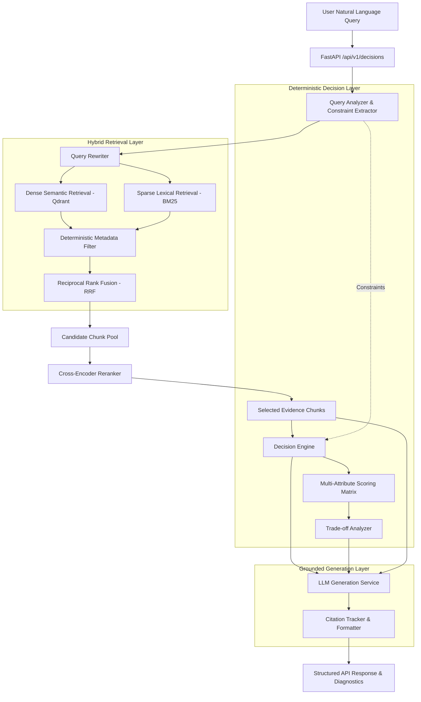

# AI Decision Engine V2

> **Decision-Augmented Retrieval-Augmented Generation (RAG) Engine for Mutual Fund Recommendation and Financial Analysis**

[](https://www.python.org/downloads/)
[](https://fastapi.tiangolo.com)
[](https://qdrant.tech/)
[](https://www.sbert.net/)
[]()

---

### Table of Contents
1. [Project Title & Overview](#1-project-title--overview)
2. [Problem Statement](#2-problem-statement)
3. [One-Paragraph Summary](#3-one-paragraph-summary)
4. [Architecture Diagram](#4-architecture-diagram)
5. [End-to-End Pipeline](#5-end-to-end-pipeline)
6. [Technology Stack](#6-technology-stack)
7. [RAG Architecture](#7-rag-architecture)
8. [Deterministic Decision Engine](#8-deterministic-decision-engine)
9. [Evidence Verification](#9-evidence-verification)
10. [Confidence & Abstention Behavior](#10-confidence--abstention-behavior)
11. [Gemini's Role](#11-geminis-role)
12. [Citation Validation](#12-citation-validation)
13. [Data Sources & Data Limitations](#13-data-sources--data-limitations)
14. [Evaluation Methodology](#14-evaluation-methodology)
15. [Benchmark Results](#15-benchmark-results)
16. [Setup Instructions](#16-setup-instructions)
17. [Environment Variables](#17-environment-variables)
18. [Running the API](#18-running-the-api)
19. [Running Tests](#19-running-tests)
20. [Running Evaluation](#20-running-evaluation)
21. [Known Limitations & Disclaimers](#21-known-limitations--disclaimers)

---

### 1. Project Title & Overview
**AI Decision Engine V2** is an audit-ready, Decision-Augmented RAG system engineered specifically for mutual fund selection and financial decision support.

### 2. Problem Statement
Standard Conversational RAG chatbots suffer from major failure modes when applied to complex financial domains:
1. **Hallucinated Numerical Comparisons:** LLMs frequently fail basic numerical filtering (e.g., recommending a high-volatility fund when the user explicitly asked for low risk).
2. **Ungrounded Claims:** Generic financial bots invent return figures, cite non-existent scheme documents, or ignore regulatory risk categories.
3. **Black-box Ranking:** LLMs cannot explain *why* a particular mutual fund was eliminated or provide auditable metric trade-offs against alternatives.

### 3. One-Paragraph Summary
AI Decision Engine V2 resolves these issues by decoupling **deterministic constraint evaluation & utility scoring** from **linguistic generation**. The engine processes natural language user queries, extracts structured financial constraints (e.g., SIP amounts, investment horizons, SEBI risk ceilings, expense ratio caps), executes hybrid dense-sparse retrieval over fund evidence documents, and computes a multi-attribute utility score across risk-adjusted returns, costs, downside protection, preference fit, and evidence quality. Google Gemini is utilized strictly for generating natural language explanations of the deterministic result, bounded by verified evidence citations.

---

### 4. Architecture Diagram



---

### 5. End-to-End Pipeline
1. **Query Analysis:** Natural language query is parsed into a structured `DecisionQuery` object containing hard constraints and soft user preferences.
2. **SQL Pre-Filtering:** SQLite/PostgreSQL executes deterministic filtering to retrieve candidate mutual funds satisfying hard constraints.
3. **Hybrid Retrieval:** Dense cosine search (Qdrant) and sparse keyword search (BM25) retrieve relevant document chunks from fund scheme information documents.
4. **Reciprocal Rank Fusion (RRF):** Merges dense and sparse document ranks.
5. **Cross-Encoder Reranking:** Re-scores document relevance using `cross-encoder/ms-marco-MiniLM-L-6-v2`.
6. **Evidence Binding & Verification:** Extracted numeric facts in document chunks are cross-checked against structured database records.
7. **Deterministic Scoring Engine:** Calculates composite utility scores based on risk-adjusted return (Sharpe), expense ratio, downside protection, preference fit, evidence quality, and AUM context.
8. **Trade-off Analysis:** Computes pairwise metric deltas against top runner-up funds.
9. **Confidence & Abstention Gate:** Evaluates system confidence across seven signals; abstains if evidence is insufficient or confidence is below threshold.
10. **Explanation Synthesis:** Google Gemini formats the final decision into natural language with verified citations (`[1]`, `[2]`).

---

### 6. Technology Stack
- **Core Framework:** Python 3.10+, FastAPI, Pydantic v2, Pydantic Settings
- **Relational Database:** SQLite (local development) / PostgreSQL (production SQL database)
- **Vector Database:** Qdrant (Server containerized or in-memory fallback)
- **Embeddings:** `BAAI/bge-small-en-v1.5` via `sentence-transformers`
- **Sparse Search:** `rank-bm25` (Okapi BM25)
- **Reranker:** `cross-encoder/ms-marco-MiniLM-L-6-v2`
- **LLM Provider:** Google Gemini (`gemini-3.8-flash`) via `google-generativeai` (with `DeterministicMockProvider` for offline testing)
- **Testing:** `pytest`, `pytest-asyncio`, `pytest-mock`

---

### 7. RAG Architecture
- **Dense Embeddings:** `BAAI/bge-small-en-v1.5` converts query and fund scheme chunks into 384-dimensional normalized vectors.
- **Qdrant Vector DB:** Stores vector embeddings with payload metadata (fund_id, document_id, section, chunk_type).
- **BM25 Lexical Search:** Captures exact keyword hits (fund names, AMC titles, SEBI category terms).
- **Reciprocal Rank Fusion (RRF):** Fuses ranks using $RRF(d) = \sum \frac{1}{k + \text{rank}(d)}$ with $k=60$.
- **Cross-Encoder Reranking:** Evaluates `(query, document_chunk)` pairs jointly for high precision context selection.

---

### 8. Deterministic Decision Engine
The Decision Engine computes final fund scores deterministically. LLMs are **not** permitted to select or rank funds.

Weighted Component Formula:
$$\text{Final Score} = w_r \cdot S_{\text{risk\_adj}} + w_e \cdot S_{\text{expense}} + w_d \cdot S_{\text{downside}} + w_p \cdot S_{\text{pref\_fit}} + w_q \cdot S_{\text{evidence}} + w_a \cdot S_{\text{aum}}$$

Default Weight Configuration:
- `weight_risk_adjusted_return`: `0.35` (Sharpe ratio 3Y)
- `weight_expense_efficiency`: `0.20` (Expense ratio min-max normalized)
- `weight_downside_protection`: `0.15` (Volatility & max drawdown 3Y)
- `weight_preference_fit`: `0.15` (Category, AMC, and objective alignment)
- `weight_evidence_quality`: `0.10` (Verified document chunk coverage)
- `weight_aum_context`: `0.05` (AUM liquidity context)

---

### 9. Evidence Verification
Before scoring, `EvidenceValidator` verifies chunk contents against database facts:
- Chunks referencing funds outside the candidate pool are discarded.
- Numeric claims in scheme summaries (expense ratio, AUM, minimum SIP) are cross-checked against DB rows.
- Contradictory document snippets are flagged as `CONFLICTING` and excluded from scoring.

---

### 10. Confidence & Abstention Behavior
System confidence is a composite score in $[0, 1]$ computed across seven signals:
1. `constraint_completeness`
2. `evidence_coverage`
3. `evidence_quality`
4. `score_margin`
5. `data_completeness`
6. `data_freshness`
7. `ranking_stability`

**Abstention Gate:** The system abstains (returns no recommendation text) when:
- Unresolvable blocking query ambiguity exists.
- No candidate passes all hard constraints.
- Verified evidence chunk count is below threshold.
- Top score margin is unstable across sensitivity trials.

---

### 11. Gemini's Role
Google Gemini (`gemini-3.8-flash`) acts strictly as an **explanation layer**:
- Gemini is provided with the winning fund, its structured facts, metric trade-offs, and verified evidence snippets.
- Gemini **cannot** change the winning fund, re-score candidates, or introduce unverified funds.
- Output is enforced as structured JSON.

---

### 12. Citation Validation
All generated statements are grounded in retrieved chunks. Injected citations (`[1]`, `[2]`) are verified by `CitationTracker`:
- Invalid or hallucinated citation markers are removed.
- Valid citations link to source URLs, document IDs, and exact text snippets.

---

### 13. Data Sources & Data Limitations
- **Database:** Local SQLite database containing 39 mutual fund schemes across Equity, Debt, Hybrid, and Liquid categories.
- **Evidence Corpus:** 265 document chunks covering scheme information documents (SID), fund factsheets, and regulatory disclosures.
- **Limitations:** Data is static as of the snapshot date. Real-world investment decisions require live market feed updates.

---

### 14. Evaluation Methodology
The system includes an automated evaluation harness (`scripts/evaluate.py`):
- **Information Retrieval (IR):** Recall@K, Precision@K, Mean Reciprocal Rank (MRR), NDCG@K.
- **Decision Engine:** Winner Accuracy, Constraint Faithfulness, Abstention Correctness.

---

### 15. Benchmark Results
Evaluated on the 6-query mutual fund evaluation benchmark (`data/evaluation/queries.json`):

| Metric | Result |
| :--- | :--- |
| **Winner Accuracy** | **100%** (6 / 6 queries) |
| **Abstention Correctness** | **100%** (1 / 1 abstention query) |
| **Mean Reciprocal Rank (MRR)** | **1.0000** |
| **NDCG@3** | **1.0000** |
| **NDCG@5** | **1.0000** |
| **Recall@5** | **1.0000** |
| **Constraint Faithfulness** | **91.67%** |
| **Unit Test Suite** | **107 / 107 passed** |

*Note: The benchmark dataset represents a focused initial evaluation suite designed for regression testing and pipeline verification.*

---

### 16. Setup Instructions

#### 1. Clone Repository & Setup Virtual Environment
```bash
python3 -m venv .venv
source .venv/bin/activate
pip install -r requirements.txt
```

#### 2. Configure Environment Variables
Copy `.env.example` to `.env` and set your credentials:
```bash
cp .env.example .env
```

#### 3. Run Ingestion & Build Vector Index
```bash
python scripts/ingest.py
python scripts/build_index.py
```

---

### 17. Environment Variables
Declared and validated via Pydantic Settings (`app/core/config.py`):

| Variable | Default | Description |
| :--- | :--- | :--- |
| `APP_ENV` | `development` | Deployment environment mode |
| `DATABASE_URL` | `sqlite:///./data/processed/funds.db` | Database connection string |
| `QDRANT_URL` | `http://localhost:6333` | Qdrant host URL (falls back to in-memory) |
| `EMBEDDING_MODEL` | `BAAI/bge-small-en-v1.5` | Dense embedding model |
| `RERANKER_MODEL` | `cross-encoder/ms-marco-MiniLM-L-6-v2` | Cross-encoder reranker model |
| `LLM_PROVIDER` | `gemini` | `gemini` (live generation) or `mock` (offline testing) |
| `GEMINI_API_KEY` | `""` | Secret API key for Google Gemini |
| `GEMINI_MODEL` | `gemini-3.8-flash` | Configurable Gemini model identifier |

---

### 18. Running the API

Start FastAPI development server:
```bash
uvicorn app.api.main:app --host 0.0.0.0 --port 8000 --reload
```

Example Request:
```bash
curl -X POST "http://localhost:8000/api/v1/decisions" \
  -H "Content-Type: application/json" \
  -d '{
    "query": "I am looking for a low risk liquid mutual fund with high safety",
    "risk_tolerance": "LOW"
  }'
```

---

### 19. Running Tests
Run the pytest test suite:
```bash
pytest tests/ -q
```
Target result: `107 passed`.

---

### 20. Running Evaluation
Run the automated evaluation harness:
```bash
python scripts/evaluate.py
```

---

### 21. Known Limitations & Disclaimers

> [!WARNING]
> **Financial Advice Disclaimer:** This software is designed for technical evaluation, educational research, and portfolio demonstration purposes only. It does **NOT** constitute financial advice, investment recommendations, or endorsement of any mutual fund scheme.

- **Data Scope:** Built on a snapshot dataset of 39 mutual funds.
- **Single-Turn Focus:** Focused on single-turn auditability rather than multi-turn conversational state.
- **No Performance Guarantees:** Past performance indicators (Sharpe ratio, CAGR) do not guarantee future returns.
