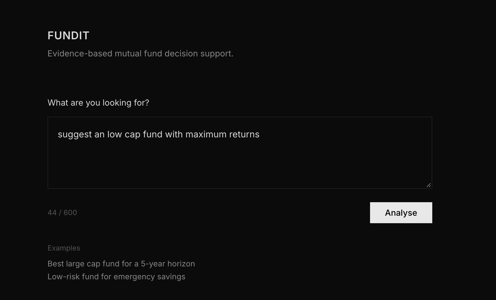
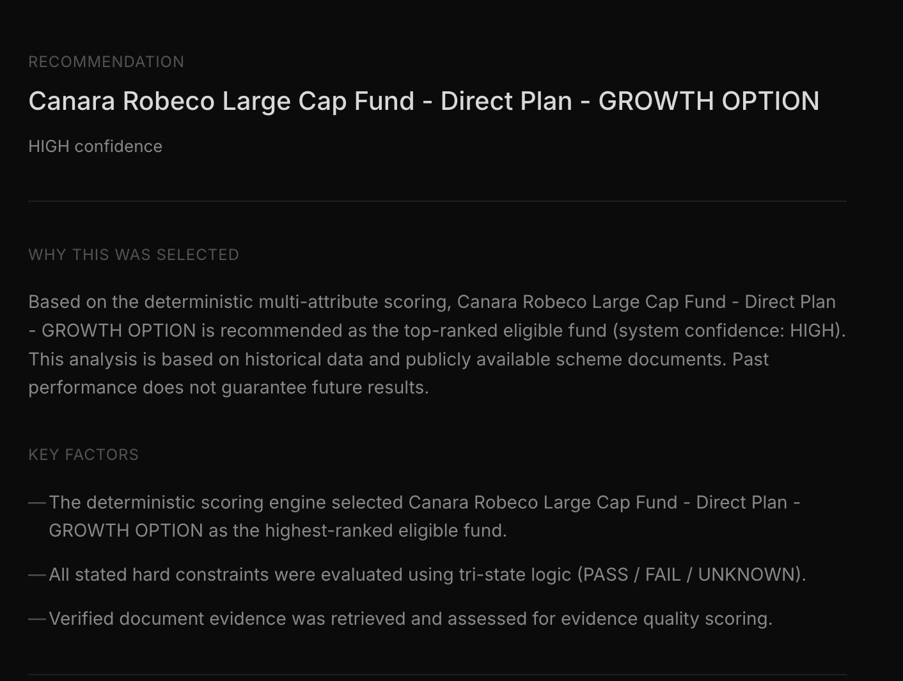

# FUNDIT

[](https://github.com/NAMITLALWANI/FUNDIT/actions/workflows/pytest.yml)

> An intelligent, evidence-based mutual fund assistant that uses Hybrid RAG and deterministic scoring to give you safe, grounded financial insights.

<video src="assets/demo.mov" width="100%" controls autoplay loop></video>

**Normal Recommendation UI**


**Constraint Violation & Abstention UI**


---

## What Is This?

**FUNDIT** is a demo-ready decision-support system designed to make analyzing Indian mutual funds easier and safer.

Just ask a natural-language investment question, and FUNDIT will do the heavy lifting:

1. Parses your intent, constraints, and preferences
2. Filters candidate funds from a structured SQL database
3. Retrieves and cross-encodes evidence from fund documents
4. Scores every candidate deterministically across six weighted dimensions
5. Gates the output through a confidence/abstention model
6. Asks Gemini to *explain* — not decide — the already-computed result
7. Returns a fully grounded, cited, structured response

**This isn't your average AI chatbot.** We never let the AI blindly rank funds. Instead, a strict, deterministic engine crunches the numbers and makes the decision. Gemini is simply there to explain the final result in plain English.

> **Disclaimer:** FUNDIT is a decision-support and research tool. It provides analysis based on historical data and publicly available scheme documents. Past performance does not guarantee future results. Mutual fund investments are subject to market risks. This is not personalized financial advice. Always consult a SEBI-registered financial advisor before investing.

---

## Why Did I Build This?

Most "AI for investing" demos out there have a few big problems:
- They use an LLM to guess which funds are best (high hallucination risk, no grounding).
- They use generic RAG over documents without any structured database filtering.
- Their decisions can't be audited because the AI's logic is a black box.

FUNDIT solves this with a **deterministic-first architecture**. The AI engine never trusts LLM judgment for ranking. Every single ranking decision is auditable, reproducible, and explainable.

---

## Architecture

```
User Query (natural language)
        ↓
┌─────────────────────────────────────┐
│  Query Analysis & Intent Extraction │
│  Constraints, objectives, horizon   │
└─────────────────────────────────────┘
        ↓
┌─────────────────────────────────────┐
│  SQL Candidate Retrieval            │
│  Filter by risk, category, expense  │
│  ratio, AUM, lock-in constraints    │
└─────────────────────────────────────┘
        ↓
┌─────────────────────────────────────┐
│  Hybrid Evidence Retrieval          │
│  ├── Dense: BAAI/bge-small-en-v1.5  │
│  ├── Sparse: BM25 (rank-bm25)       │
│  └── Fusion: Reciprocal Rank Fusion │
└─────────────────────────────────────┘
        ↓
┌─────────────────────────────────────┐
│  Cross-Encoder Reranking            │
│  ms-marco-MiniLM-L-6-v2             │
└─────────────────────────────────────┘
        ↓
┌─────────────────────────────────────┐
│  Evidence Verification              │
│  Conflict detection, staleness      │
└─────────────────────────────────────┘
        ↓
┌─────────────────────────────────────┐
│  Deterministic Decision Engine      │
│  Multi-attribute utility scoring    │
│  • Risk-adjusted return (35%)       │
│  • Expense efficiency       (20%)   │
│  • Downside protection      (15%)   │
│  • Preference fit           (15%)   │
│  • Evidence quality         (10%)   │
│  • AUM context               (5%)   │
└─────────────────────────────────────┘
        ↓
┌─────────────────────────────────────┐
│  Confidence & Abstention Gate       │
│  HIGH / MEDIUM / LOW / ABSTAIN      │
└─────────────────────────────────────┘
        ↓
┌─────────────────────────────────────┐
│  Gemini (Explanation Only)          │
│  Explains the deterministic result  │
│  Validates citations against chunks │
└─────────────────────────────────────┘
        ↓
Structured Response + Decision Trace
```

---

## Key Design Decisions

### Why Not Just Use an LLM?
LLMs hallucinate financial data, cannot enforce hard constraints reliably, and produce decisions that cannot be audited. FUNDIT keeps LLMs in the explanation layer only.

### Hybrid RAG
Dense retrieval captures semantic similarity. BM25 captures keyword matches (fund names, scheme codes, financial jargon). Reciprocal Rank Fusion combines both without a learned mixing weight.

### Deterministic Scoring
Every fund gets a composite score from verifiable structured data (NAV history, expense ratio, Sharpe ratio, max drawdown, AUM). Weights are configurable and documented.

### Evidence Verification
Retrieved chunks are checked for contradictions before they are passed to Gemini. Gemini cannot cite chunk IDs it did not receive. Citation IDs in the final response are validated post-generation.

### Confidence & Abstention
If evidence is insufficient, margin between top candidates is too narrow, or hard constraints cannot be satisfied, the system abstains rather than returning a low-confidence guess.

---

## Data

| Dataset | Size |
|---------|------|
| Funds in universe | 39 |
| NAV data points | 128,167 |
| Evidence documents | 41 |
| Evidence chunks (indexed) | 265 |
| SEBI regulatory documents | 2 |
| Fund scheme documents | 39 |

All data is real mutual fund data from AMFI/SEBI. No fabricated financial data.

**Data limitations:** Historical NAV data has a fixed cutoff. The system cannot reflect funds launched or NAV movements after the last ingestion date.

---

## Evaluation Benchmark

Evaluated on a 6-query genuine mutual-fund benchmark grounded in the actual database:

| Metric | Score |
|--------|-------|
| Winner Accuracy | **100%** |
| Abstention Correctness | **100%** |
| Recall@1 | 0.5389 |
| Recall@3 | 0.8667 |
| Recall@5 | **1.0000** |
| Precision@1 | 0.8333 |
| MRR | **1.0000** |
| NDCG@3 | **1.0000** |
| NDCG@5 | **1.0000** |
| Constraint Faithfulness | 91.67% |

> Note: The benchmark and citation coverage were measured using a mock LLM (MockProvider) in offline evaluation, not Gemini. Therefore, these benchmark numbers describe the deterministic engine's performance, not Gemini's measured explanation quality.

Run the benchmark yourself:
```bash
python scripts/evaluate.py
```

---

## Technology Stack

| Component | Technology |
|-----------|-----------|
| API Framework | FastAPI 0.111+ |
| Workflow Orchestration | LangGraph |
| Vector Database | Qdrant 1.12 |
| Dense Retrieval | BAAI/bge-small-en-v1.5 (SentenceTransformers) |
| Sparse Retrieval | BM25 (rank-bm25) |
| Reranking | cross-encoder/ms-marco-MiniLM-L-6-v2 |
| Structured Database | SQLite (PostgreSQL-compatible) |
| LLM (explanation) | Google Gemini 2.5 Flash |
| Config | Pydantic Settings |
| Tests | pytest (107 passing) |
| Containerization | Docker + Docker Compose |

---

## Local Setup

### Prerequisites
- Python 3.12+
- Docker (for Qdrant in persistent mode)

### 1. Clone & install

```bash
git clone <repo-url>
cd FUNDIT
python -m venv .venv
source .venv/bin/activate
pip install -r requirements.txt
```

### 2. Configure environment

```bash
cp .env.example .env
# Edit .env — minimum required:
# LLM_PROVIDER=gemini
# GEMINI_API_KEY=your_key_here
# GEMINI_MODEL=gemini-2.5-flash
```

### 3. Start Qdrant

```bash
docker compose up qdrant -d
```

### 4. Ingest data (first time only)

```bash
python scripts/ingest_funds.py
python scripts/build_index.py
```

### 5. Start the server

```bash
uvicorn app.api.main:app --reload
```

Open [http://localhost:8000](http://localhost:8000) for the web UI.

API docs: [http://localhost:8000/docs](http://localhost:8000/docs)

---

## Environment Variables

| Variable | Default | Description |
|----------|---------|-------------|
| `LLM_PROVIDER` | `mock` | `gemini` or `mock` |
| `GEMINI_API_KEY` | — | Google AI Studio API key |
| `GEMINI_MODEL` | `gemini-2.5-flash` | Gemini model name |
| `QDRANT_URL` | `http://localhost:6333` | Qdrant server URL |
| `QDRANT_FALLBACK_IN_MEMORY` | `true` | Fallback when Qdrant unreachable (dev only) |
| `ALLOWED_ORIGINS` | `` | Comma-separated CORS origins (empty = localhost only) |
| `DATABASE_URL` | `sqlite:///./data/processed/funds.db` | SQLAlchemy URL |
| `PRELOAD_MODELS_ON_STARTUP` | `false` | Pre-warm models at startup |
| `APP_ENV` | `development` | `development`, `testing`, `production` |

Full reference: [`.env.example`](.env.example)

**Security:** `GEMINI_API_KEY` is server-side only. It is never sent to the frontend or included in API responses.

---

## Docker

### Full stack (app + Qdrant)

```bash
cp .env.example .env
# Fill in GEMINI_API_KEY in .env
docker compose up --build -d
```

Open [http://localhost:8000](http://localhost:8000).

### First-time data initialization inside Docker

```bash
docker compose exec app python scripts/ingest_funds.py
docker compose exec app python scripts/build_index.py
```

### Stop

```bash
docker compose down
# Data is preserved in Docker volumes: qdrant_data, app_data
```

---

## API

### `GET /health` — Liveness
```json
{ "status": "ok", "version": "2.0.0", "app_name": "FUNDIT" }
```

### `GET /ready` — Readiness
```json
{
  "ready": true,
  "vector_store_healthy": true,
  "models_loaded": true,
  "indexed_chunks_count": 265
}
```

### `POST /api/v1/decisions` — Main endpoint

**Request:**
```json
{
  "query": "Which large cap fund is suitable for a 5-year horizon with moderate risk?",
  "debug": false
}
```

**Response (abbreviated):**
```json
{
  "query": "Which large cap fund is suitable...",
  "abstained": false,
  "winner": {
    "fund_id": "MF-120843",
    "fund_name": "Mirae Asset Large Cap Fund",
    "composite_score": 0.78,
    "structured_facts": {
      "cagr_3y": 14.2,
      "expense_ratio": 0.54,
      "sharpe_ratio_3y": 1.12,
      "risk_level": "Moderately High"
    }
  },
  "confidence": { "level": "HIGH", "score_margin": 0.09 },
  "reasons": ["..."],
  "tradeoffs": ["..."],
  "citations": [
    {
      "citation_id": "[1]",
      "title": "Mirae Asset Large Cap Fund — Scheme Information",
      "snippet": "...",
      "source": "AMFI"
    }
  ],
  "disclaimer": "..."
}
```

Interactive API explorer: [`/docs`](http://localhost:8000/docs)

---

## Project Structure

```
.
├── app/
│   ├── api/          # FastAPI routes, schemas, middleware
│   ├── core/         # Config, logging, exceptions, dependencies
│   ├── db/           # SQLAlchemy models, repository, session
│   ├── decision/     # Deterministic scoring, confidence, constraints
│   ├── evidence/     # Evidence verification and conflict detection
│   ├── generation/   # Gemini/mock providers, citation validation
│   ├── ingestion/    # Data loading, chunking, pipeline
│   ├── query/        # Query analysis, intent extraction, rewriting
│   ├── retrieval/    # Dense (Qdrant), sparse (BM25), hybrid (RRF)
│   ├── reranking/    # Cross-encoder reranking
│   ├── static/       # Frontend (single-page UI, no build step)
│   └── workflow/     # LangGraph orchestration graph
├── data/
│   ├── documents/    # Fund scheme documents + SEBI regulatory docs
│   ├── evaluation/   # Benchmark query set
│   ├── processed/    # Generated SQLite DB (gitignored)
│   └── raw/          # Raw NAV + scheme attribute JSON files
├── docs/             # Architecture, decision engine, retrieval docs
├── scripts/          # ingest_funds.py, build_index.py, evaluate.py
├── tests/            # 107 unit + integration tests
├── Dockerfile
├── docker-compose.yml
└── .env.example
```

---

## Running Tests

```bash
pytest tests/ -v
# 107 passed, 1 warning (Qdrant local payload index warning — expected in test mode)
```

---

## Known Limitations

1. **Data freshness** — NAV data has a fixed cutoff. The system does not auto-update from AMFI.
2. **39 funds** — The current universe is limited. A production system would cover AMFI's full ~2,000+ scheme universe.
3. **Single-node** — Designed for small-scale demo deployment. Not load-tested for concurrent users.
4. **English only** — Query analysis is English-only.
5. **Citation coverage** — Gemini citation coverage depends on evidence chunk availability per fund.

---

## Future Improvements

- Auto-ingestion pipeline via AMFI daily NAV feed
- Full AMFI universe (2,000+ schemes)
- Portfolio-level analysis (multi-fund allocation)
- SIP return projections
- XIRR / goal-based planning
- User-specific constraint memory
- Streaming API responses (SSE)

---

*FUNDIT is a portfolio project. It is not affiliated with AMFI, SEBI, or any fund house.*
