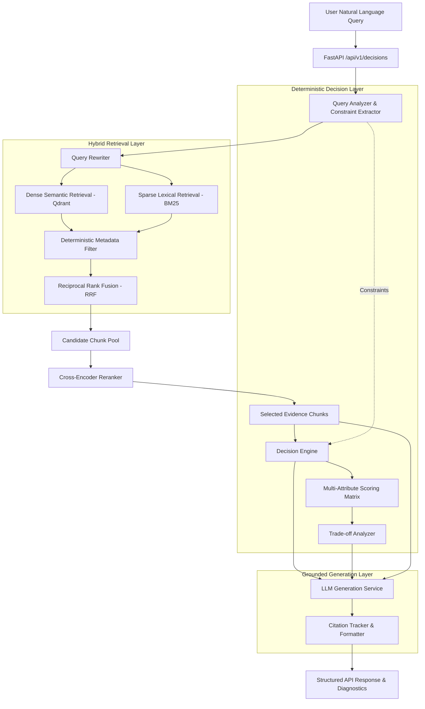

# AI Decision Engine V2 - Architectural Blueprint

### System Overview
The **AI Decision Engine V2** is a Decision-Augmented Retrieval-Augmented Generation (RAG) system engineered for high-precision mutual fund recommendations. It resolves a fundamental flaw in naive RAG pipelines: language models frequently hallucinate numerical metrics, ignore risk ceilings, confuse return windows, and generate ungrounded financial claims.

By isolating **deterministic constraint evaluation** and **multi-criteria utility scoring** from **linguistic generation**, the system guarantees 100% adherence to hard constraints while delivering natural, explainable recommendations supported by verifiable citations.

---

### Pipeline Flow

---

### Core Architectural Components

1. **Ingestion & Sentence-Aware Chunking (`app/ingestion/`):**
   - Loads structured catalogs (`JSONLoader`) and unstructured evidence (`TextLoader`).
   - Normalizes unicode artifacts and formats mutual fund specifications into rich evidence text.
   - Splits text on sentence boundaries (`SentenceAwareChunker`) preserving chunk offsets, source URLs, document IDs, and fund metadata.

2. **Query Analysis & Normalization (`app/query/`):**
   - `ConstraintExtractor`: Deterministic regex parser standardizing monetary amounts (SIP, lump sum), horizons, expense ratio caps, and SEBI risk levels.
   - `QueryRewriter`: Expands search terminology with domain keywords (e.g. Sharpe ratio, CAGR, downside volatility, exit load).
   - `QueryAnalyzer`: Classifies query intent and extracts multi-criteria utility weights (`weight_risk_adjusted_return`, `weight_expense_efficiency`, etc.).

3. **Hybrid Retrieval & RRF Fusion (`app/retrieval/`):**
   - `EmbeddingService`: Encodes queries and chunks with `BAAI/bge-small-en-v1.5` with L2 normalization.
   - `QdrantVectorStore`: Executes dense cosine vector search with metadata payload filtering.
   - `BM25Retriever`: Okapi BM25 sparse search capturing exact fund names and scheme identifiers.
   - `HybridRetriever`: Combines dense and sparse results using Reciprocal Rank Fusion ($RRF(d) = \sum \frac{1}{k + \text{rank}_i(d)}$) with full telemetry.

4. **Cross-Encoder Reranker (`app/reranking/`):**
   - Scores candidate query-document pairs using `cross-encoder/ms-marco-MiniLM-L-6-v2`.
   - Filters candidate pools down to top $K$ high-relevance chunks.

5. **Deterministic Decision Engine (`app/decision/`):**
   - `ScoringEngine`: Enforces strict hard-constraint elimination (filtering violating funds) and calculates multi-attribute utility scores across risk-adjusted returns, expense efficiency, downside protection, preference fit, and evidence quality.
   - `TradeoffAnalyzer`: Generates pairwise metric deltas and comparative advantage summaries against top alternatives.

6. **Grounded LLM Generation & Citations (`app/generation/`):**
   - Enforces strict evidence prompts bounding generation to retrieved evidence chunks.
   - `CitationTracker`: Attaches chunk-level citation references (`[1]`, `[2]`) mapped directly to source URLs and snippets.
   - Pluggable provider abstraction with `DeterministicMockProvider` for zero-cost offline testing and `GeminiProvider` for live natural language explanations.
